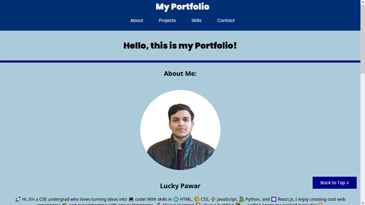

# My Personal Portfolio Webpage

## Project Title
Static Portfolio Webpage

## 📝 Project Description
This project is a static personal portfolio website developed using fundamental web technologies: HTML for structure and CSS for styling. It serves as a professional showcase of my technical skills, completed projects, and contact information.

This mini-project was built using **Visual Studio Code**, maintained with **Git**, and is hosted on **GitHub**, demonstrating proficiency in standard modern software development tools.

## ✨ Project Features

* **Responsive Header & Navigation:** A sticky header with links to all main sections: About, Projects, Skills, and Contact.
* **Hero Section:** Includes a developer photograph and a brief personal introduction.
* **Projects Showcase:** Detailed descriptions of hypothetical software projects (e.g., E-Commerce, OS Simulators).
* **Skills Matrix:** An organized table listing core technical competencies (HTML, CSS, JavaScript, Python).
* **Contact Form:** A basic HTML form for collecting visitor inquiries, structured within a table.
* **Back to Top:** A fixed navigation link for quick access to the top of the page.

## 💻 Installation and Usage

Since this is a static project utilizing only HTML and CSS, no external libraries or complex server-side installation is required.

1.  **Clone the Repository:**
    ```bash
    git clone https://github.com/lucky-KRMU/CSFCP---Assignment---Static-portfolio-website.git
    ```
2.  **Open the Webpage:**
    Navigate to the cloned directory and open the `index.html` file directly in any modern web browser (e.g., Chrome, Firefox, Edge).

## 📸 Screenshots of the Application




---

## 📚 Documentation

For detailed information regarding the development process and future plans, please refer to the dedicated documentation folder:
* [Link to docs/overview.md](https://github.com/lucky-KRMU/CSFCP---Assignment---Static-portfolio-website/blob/main/docs/folder/overview.md) (Project Overview)
* [Link to docs/development.md](https://github.com/lucky-KRMU/CSFCP---Assignment---Static-portfolio-website/blob/main/docs/folder/development.md) (Development Process)
* [Link to docs/future_improvements.md](https://github.com/lucky-KRMU/CSFCP---Assignment---Static-portfolio-website/blob/main/docs/folder/future_improvements.md) (Future Improvements)

***

## 2. `.gitignore` Content

This file ensures that unnecessary files and folders generated by the IDE and operating system are excluded from the Git repository.

```gitignore
# Visual Studio Code
.vscode/

# Operating System Files
.DS_Store
Thumbs.db

# Log files
*.log

# Temporary Files
*.tmp